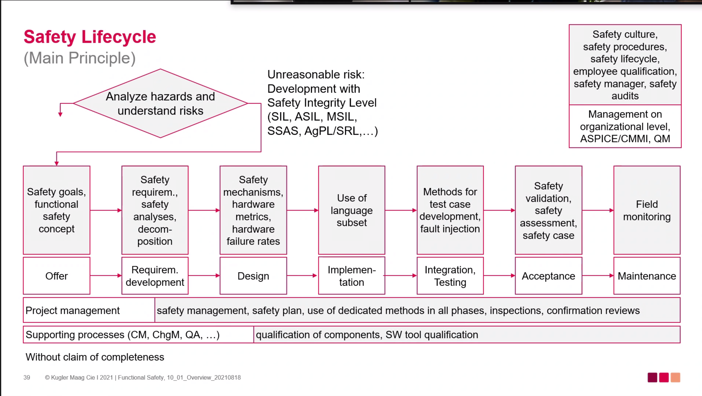
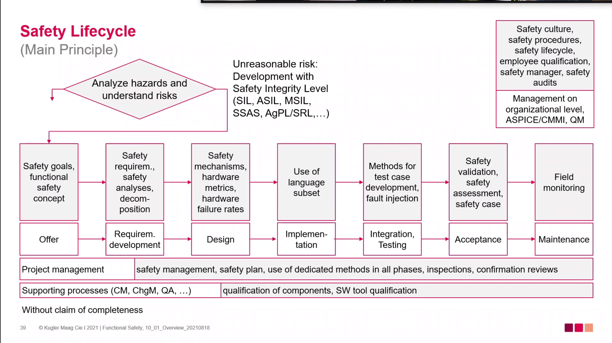
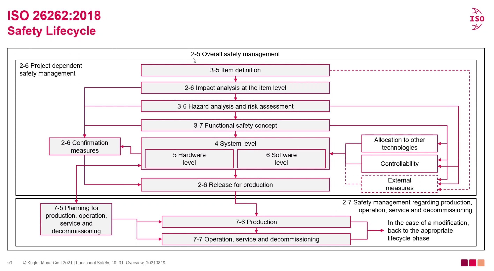
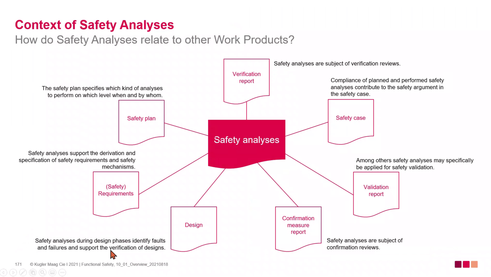

# Safety Analyses Day 1

## Overview

* Security?
  * From external hardad
  * Fuctional safefy?

* Safety?
  * from the operation of a system(product, device)

* Safety Analysee (ISO26262-9, clauese 8)
  * to identity faults
  * to examin thje consequnce of faults and fauliures on functions, behavior and design
  * to provicde information on conditions and causes taht could lead to violation oof a safety goal
  * to iddentify new functional or non-fuctional hards not pre considered
  * to veritfty validate saftety goal concepts reqs.
  * to identify addtional reqs. for avoidence dections and control of faults.

* Safety LifeCycle

* Safety LifeCycle(main priciple)

* Safety LifeCycle (iso2626P:2018)

* ISO 26262 2nd Edition
  * 6. Product development SW level
    * 6.5 General topics for the product development at the software level
    * 6.6 Spec. of SW safety req.
    * 6.7 SW Arch. Design
    * 6.8 SW Unit Design
    * 6.9 SW Integration and verification
    * 6.10 Software integration and verification
    * 6.11 Testing of the embeded SW

  * ISO 26262-6
    * Design phase verify - *Safety analysis report*
    * 6-7 Dependent failures anaysis report
    *

* ISO 26262-0 ASI-orifented and safety -oriendted Analyses
- Req for ASIL- and safety-orifened analyses
  - Reqs decomposition with respect to ASIL tailoring :Rules and guidence for decomposing safety reqs into redundant safety reqs to allow ASIL tailoring
  - Critra for coexistance of elemets :priove critedra for coexistence of safety-related sub-elements assigned ddiffence ASILs
  - Analysis of depenedent fialures : Identift any sing event or signle cause that bypass or invailidate the indepence between elements.
  - ssafty analyses : Examin the consequences of fauls and failures on functions, behavio

* Why to peform Safety Analyses?
  * To identifty hazards
  * faulut and failures
  * support and verify the design
  * specify safety mechanisms
  * derive test cases

* How do safety Analyses realte to other Work Products ?

* **Summarry**
  * importante element dureing the dev. of safety-realted automotive electionic systmes
  * iso26262 reqs perfoming safety analyses to support reqs and design activies on system
  * Safety analyses help to systemically undersatnd risks of desgin by analyzing faults and thier consequences.
  * There is not one single method to perfom safety analses.

## Safety Analyses

### Responsibility
* PM (project manager)
  * Safety Activities are perfomed
  * Complience with iso26262 is achieved
  * the saftey manger is appointed
* Safety Manager

### Planning
* **hall incldue**
  * the activities and procedure for achieving fuctional safety
  * analysis of dependent failures and the safety analyses
  * the integartion, verification and validation acitivies

