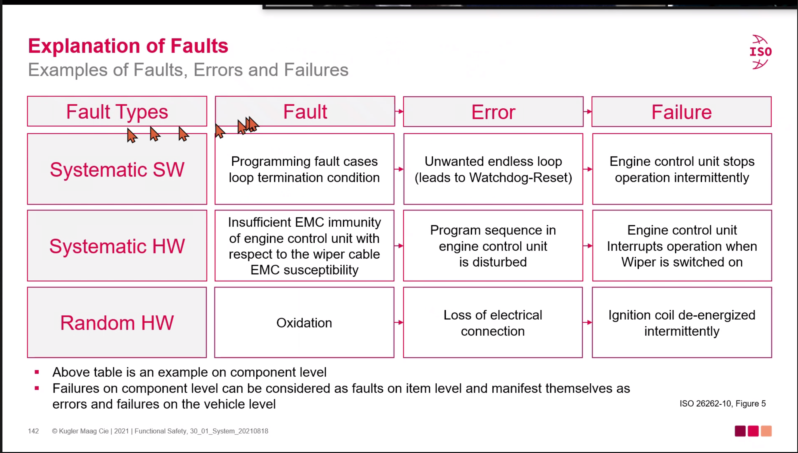
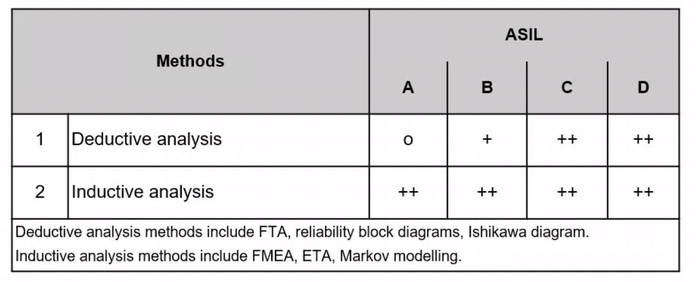
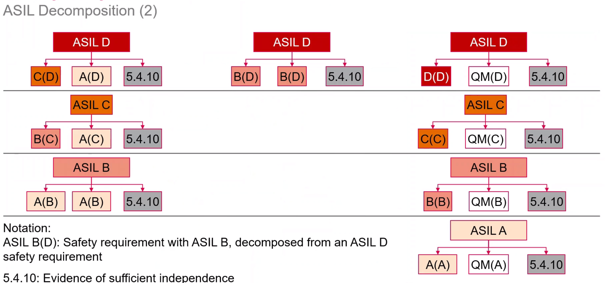
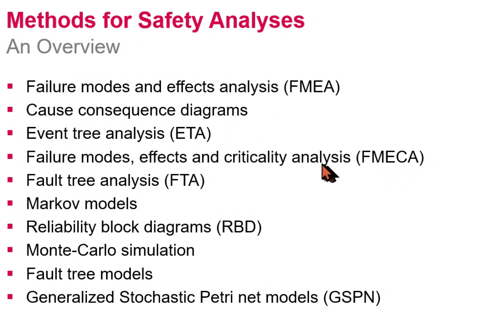

# Safety Analyses Day 1

## Methods for Safety Analyses and Safety Analysese on system Level

* Explanation of Faults

  * systmematic HW - Random HW
    * systematic은 특정 상황에서 발생

* System Design Safety Analyses
  * Perfoem safety of the system design accoding to the folllowing table and iso 26262-9, clause 8
  

## ISO26262-9

### ASIL Decomposition

* **Obecjectvie**
  * To ensure that a safety req. is decomposed into redundant safety reqs at the next level of detail, and that these are allcocated to sufficiently indepent design elemets
  * To apply ASIL decomposition according ot permitted ASIL decomposition schemas

* **Benefit?**
  * Avoid signle-point faults, achieve hw qunatiative tagets
  * less developments effort because of lower ASIls or elements
  * Avoid implementing intended functionality with ASILs

### ASIL Decompotion
  
    * why?
      * ......

### ASIL Decompotion(3)
  * ASIL decompostion taolopring during the design process
    * ASIL decompostion applies to **safety reqs**, not to ach elemets
    * decomposition can related to any archi lv.
    * more than one such ASIL decomposition may be applied
  * Possible reasons for decomposition:
    * Reduced developmennt effort for decomposed elements due to reduced ASIL.(eg. analysis effort, specificaiton effort, review, test)
    * Redundancy allows to achieve hardware metires and reliability targets easier. (eg. less single point faults)

### ASIL Decompotion(4)
  * similar safety reqs., sufficiently indepnednt achitectual emelmets or subsystems.
  * Use reduced ASIL for developments activities.
  *

### Analysis of dependent Failures (1)
  * Objectives
    * To confirm tha tareq independece or freedom from interference is sufficiently achieved in the design by analysing their potential causes or initiaotrs
    * To define safety measures to mitigages plausible dependent failures , if nessary
    * The following info. shall be availabvle for the analsis:
      * Req for indepence and freedom from interfeerence at the applied lv.
      * Acrhi. info.

  * Dependent Faulures
    * failure that not stiatistically indepent.

### Analysis of dependent Failures (2)
  * Each identified potiential for dependent faulures shall be evaluated to determin if foreseeable causes exist that lead to the occurrence of dependent failures and consequently violates a requred independece.

### Safety analyses (general)
  * Objcetive
    * To ensure that the risk of a safety goal violation due to systematic faults or random hardware faults is sufficiently low
  * Validation / verification of safety goal safety concepts and safety reqs.
  * Indentifacation of conditions, faults and failures taht could lead to a vilation of safety

### Methods for Safety Analyses
  

### Safety Analyses in the safety lifecycle
  * Purpose is to assit int the design

## Realibility Block Diagram (RBD)

### Goal and Definition
* Goal
  * Set of events that must take place  and conditons which must be fullfiled for a succesful operation of a system or a task
  * Depict Success path cosisting of blocks, line and logical juctions.
  * more a method of reporesentation than a method of analysis.

???????

### FTA (Fault Tree Analysis)

#### FTA
  * Analytical technique where the causess of an undesired state of a system are analyzed
  * the system is anayzed using boolen logic in the context of its enviroments and operation to find all circumstances under which the top event can occur
  * Graphic model of the parallel and sequential combinations of fauls whic can cause the top event
  * Top-down, deductive approch

